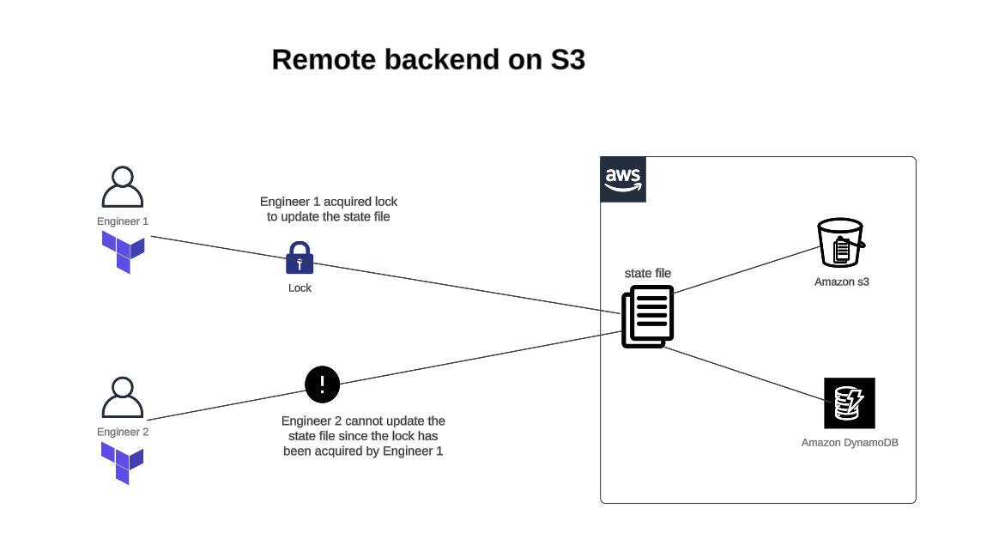

# s3 remote backend setup

Refer to my blog for the walkthrough:

[Getting started with automation in AWS Part2: s3 remote backend](https://medium.com/@oraymond49/getting-started-with-automation-in-aws-part-2-s3-remote-backend-e57bc232b642)
